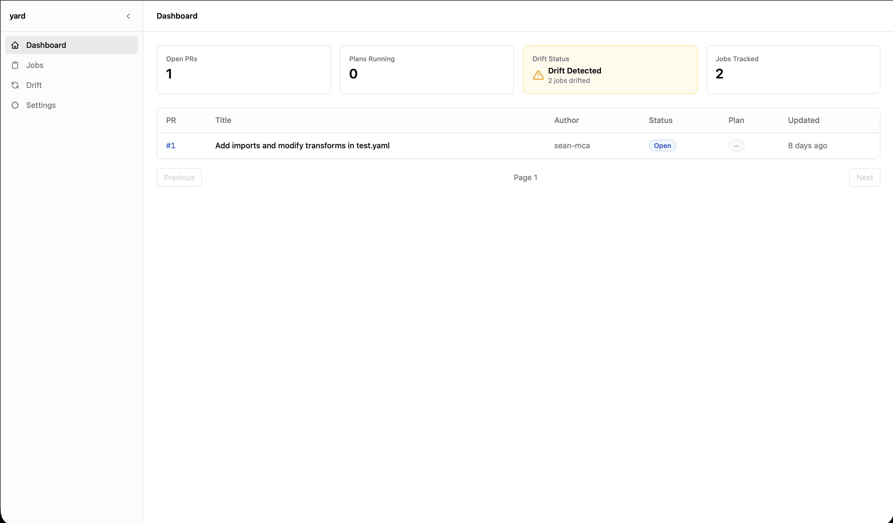
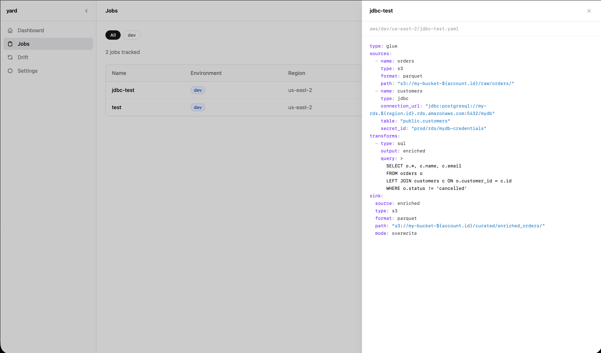
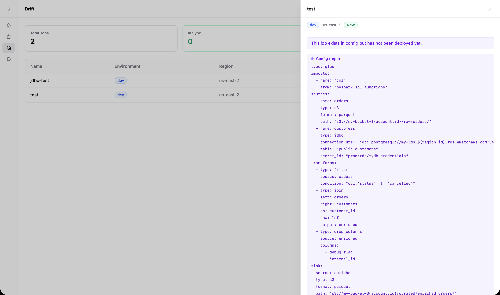

# YARD

**YAML Architecture for Rapid Development**

[](https://github.com/sean-mca/yard/actions/workflows/ci.yml)
[](LICENSE)

Declarative infrastructure for data pipelines. Define ETL jobs in YAML, and YARD generates the PySpark scripts, manages state, and deploys to AWS. Think Terragrunt, but for data engineering.

## Why YARD?

Most data teams manage Glue jobs, EMR steps, and Airflow DAGs through a mix of Terraform, custom scripts, and ClickOps. When someone leaves, the knowledge of how things are wired together leaves with them.

YARD replaces all of that with a single YAML-driven workflow:

- **One file per job.** No Terraform modules, no CloudFormation, no copy-pasted boilerplate.
- **PySpark codegen.** Write transforms in YAML, get production-ready scripts. Or bring your own.
- **Plan/apply lifecycle.** See what will change before it changes. State is per-job, so teams deploy concurrently without locks.
- **Airflow DAG generation.** Drop a `dag.yaml` marker in a directory, and YARD generates the DAG Python file with dependency wiring and uploads it to your MWAA bucket.

## Demo

```yaml
# orders.yaml
type: glue
role: arn:aws:iam::123456789:role/GlueJobExecutionRole

source:
  type: s3
  format: parquet
  path: s3://data-lake/raw/orders/

transforms:
  - type: filter
    condition: "col('status') != 'cancelled'"

sink:
  type: s3
  format: parquet
  path: s3://data-lake/curated/orders/
  mode: overwrite
```

```
$ yard plan
--- Plan for my-project ---

  + Create job [orders]

$ yard apply --auto-approve
Applying...
  + Created: orders

State updated successfully.
```

That's it. YARD generated the PySpark script, uploaded it to S3, and created the Glue job.

## Providers

| Provider | Status | What it does |
|----------|--------|--------------|
| AWS Glue | Stable | Generates PySpark scripts, uploads to S3, creates/updates Glue jobs |
| AWS EMR (classic) | Stable | Generates PySpark scripts, uploads to S3, submits steps to existing clusters |
| Airflow DAGs | Stable | Generates Airflow DAG Python files from YAML, uploads to a DAGs bucket |
| Databricks | Planned | Job creation/update/destroy against the Databricks Jobs API |
| AWS EMR Serverless | Planned | Submit job runs to serverless Spark applications |

## Project structure

```
my-project/
  yard.yaml                      # Root config: project name, state backend, providers
  aws/
    dev/
      account.yaml               # Account-level context (inherited by jobs below)
      us-east-2/
        region.yaml              # Region-level context
        orders.yaml              # Job definition
        customers.yaml           # Job definition
    prod/
      account.yaml
      us-east-1/
        region.yaml
        orders.yaml
```

Directory hierarchy mirrors your cloud topology. Context files (`account.yaml`, `region.yaml`) at each level are inherited by all job files below them. Variables are referenced with `${account.id}`, `${region.id}`, etc.

## CLI

```
yard init              Initialize state for all jobs
yard plan              Show what would change
yard apply             Deploy changes (with confirmation)
yard show <job>        Display the generated script
yard validate          Check all job definitions
yard destroy [job]     Tear down deployed jobs
yard force-unlock <job>  Remove a stale lock
```

All commands support `--no-color` and `--colorblind`. `--target <job>` scopes plan/apply to a single job. `--auto-approve` and `--dry-run` work on apply and destroy.

## yard-server

Web dashboard with GitHub webhook integration and drift detection. PR-driven workflow: plan runs automatically on PR open, apply triggered by commenting `yard apply`.







See [yard-server docs](docs/server.md) for setup instructions.

## Architecture

Rust workspace with four crates:

| Crate | Purpose |
|-------|---------|
| `yard-cli` | Thin CLI wrapper -- parses args, calls core, formats output |
| `yard-core` | Business logic -- codegen, state, storage, validation, providers |
| `yard-structs` | Shared types -- job definitions, state, config |
| `yard-server` | Web dashboard -- Dioxus fullstack, axum API, DynamoDB |

Provider system is trait-based. Adding a new provider means implementing the `Provider` trait -- no changes to existing code.

## Documentation

- [Job definitions](docs/jobs.md) -- sources, transforms, sinks, external scripts
- [Root config (yard.yaml)](docs/config.md) -- state backends, provider defaults
- [Airflow DAGs](docs/airflow.md) -- DAG generation, MWAA setup, operator mapping
- [yard-server](docs/server.md) -- dashboard setup, webhooks, drift detection


## AI Disclosure
Claude was used as follows:
- yard-server 
    - UI creation as I'm horrible at FE but wanted to try Dioxus
- Documentation: This README & `docs/**`
- General: a partner "architect"
    - example: "I think I want to design feature X like this, give me pros, cons, and any critical issues"
- General: repeating work I had already done
    - example: I wrote the initial commands in yard-cli/src/parser.rs, and would ask Claude to fill in new ones by copying what I did
- General: helping me find tech debt early
    - example: "Find all of the `unwrap()`s I missed"
