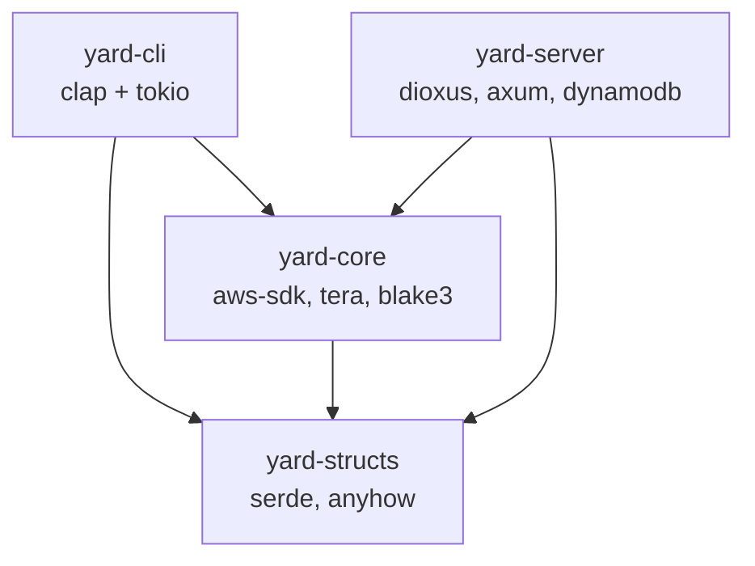
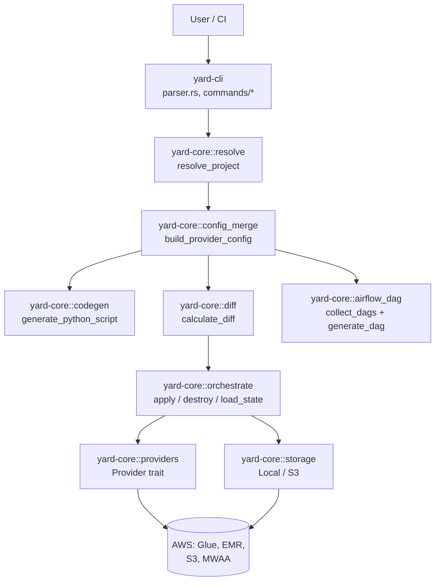

<!-- generated-by: gsd-doc-writer -->
# Architecture

## System overview

YARD is a Rust CLI and companion server for data-engineering infrastructure. It consumes a Terragrunt-style hierarchical YAML tree rooted at `yard.yaml`, generates PySpark scripts from declarative job definitions, tracks per-job deployment state, and pushes the resulting artifacts to target services (AWS Glue, EMR classic, Airflow/MWAA). The companion `yard-server` adds a GitHub-webhook-driven PR workflow, periodic drift detection against live AWS resources, and a Dioxus fullstack dashboard backed by DynamoDB.

The workspace is split into four Cargo crates with a strict layering rule: the CLI is a thin wrapper, all business logic lives in `yard-core`, and `yard-structs` holds the serialisable data types shared between the CLI, the core, and the server.

## Workspace layout

The workspace is declared in `Cargo.toml` at the repository root:

```toml
[workspace]
resolver = "3"
members = ["yard-cli", "yard-core", "yard-structs", "yard-server"]
```

| Crate | Binary/library | Purpose |
|-------|----------------|---------|
| `yard-cli` (package name `yard`) | `yard` binary | Parses `clap` args, delegates to `yard-core`, prints results. No business logic. |
| `yard-core` | library | Codegen, providers, storage, validation, diff, DAG generation, orchestration. |
| `yard-structs` | library | Shared `serde` types: `ProjectManifest`, `JobDefinition`, `JobState`, `JobDiff`, `StateBackend`, `LockInfo`, `Resource`. Minimal deps (`serde`, `anyhow`, `serde_json`). |
| `yard-server` | Dioxus fullstack binary | GitHub webhooks, drift polling, Slack alerting, Axum API, Dioxus/Tailwind dashboard, DynamoDB persistence. |

## Crate dependency graph



Only `yard-cli` and `yard-server` are top-level consumers. `yard-core` never depends on `yard-cli` or `yard-server`, and `yard-structs` depends on nothing inside the workspace — this keeps the shared types small and cheap to depend on.

## Component diagram — end-to-end plan/apply



## Data flow — `yard apply`

1. `yard-cli::main` boots a `tokio` runtime and calls `yard::run()` in `yard-cli/src/lib.rs`, which parses the `Cli` struct in `yard-cli/src/parser.rs` and dispatches to `commands/apply.rs`.
2. `commands/apply.rs` calls `yard_core::resolve::resolve_project(base_path)` (`yard-core/src/resolve.rs`). This walks parent directories to find `yard.yaml`, loads each `account.yaml` / `region.yaml` / `dag.yaml` marker, discovers job YAML files, and assembles a `ResolvedProject { manifest, current_state, root_dir }`.
3. Provider-level config is merged with per-job overrides by `yard_core::config_merge::build_provider_config` (`yard-core/src/config_merge.rs`).
4. `yard_core::diff::calculate_diff(&manifest, &state)` in `yard-core/src/diff.rs` generates each job's script via `codegen::generate_python_script`, concatenates script + serialised config, hashes with BLAKE3, and emits `JobDiff { Create | Modify { changes } | Delete }` entries.
5. `yard_core::orchestrate::apply` (`yard-core/src/orchestrate.rs`) acquires per-job locks via `Storage::lock_jobs` (atomic with rollback), then for each changed job:
   - Instantiates a `Box<dyn Provider>` via `providers::get_provider(job_type, &merged_config)`.
   - Calls `provider.deploy(job_name, &artifact, &job_config)` which uploads the generated script to S3 and creates/updates the target resource (Glue job, EMR step, etc.).
   - Writes the resulting `JobState { deployment: Deployment { resources, config_hash, status, applied_at, ... } }` via `Storage::write_job`.
6. Airflow DAGs are handled in a parallel pipeline via `yard_core::dag_lifecycle::apply_dags` using `airflow_dag::collect_dags` and `airflow_dag::generate_dag`, with per-DAG state stored under the `_dag_` prefix (see `DAG_STATE_PREFIX` in `yard-core/src/storage.rs`).
7. Locks are released (rollback-safe) and a summary is returned to `yard-cli`, which formats and prints it.

## Key abstractions

### `Provider` trait — `yard-core/src/providers/mod.rs`

All deploy targets implement this async trait. Implementations live alongside it (`glue.rs`, `emr.rs`). Adding a new provider (e.g. Databricks, EMR Serverless) means adding a new file and extending the `get_provider` dispatch — no changes to existing providers.

```rust
pub trait Provider: Send + Sync {
    fn deploy(&self, job_name: &str, artifact: &str, job_config: &Value)
        -> Pin<Box<dyn Future<Output = Result<Vec<Resource>>> + Send + '_>>;
    fn destroy(&self, job_name: &str, resources: &[Resource])
        -> Pin<Box<dyn Future<Output = Result<()>> + Send + '_>>;
    fn verify_resources(&self, job_name: &str, resources: &[Resource])
        -> Pin<Box<dyn Future<Output = Result<Vec<ResourceStatus>>> + Send + '_>>;
}
```

`deploy` returns the `Resource`s it created so state can track them. `verify_resources` is used by drift detection to catch out-of-band deletions. Shared S3 script upload/delete helpers live on `S3ScriptOps` in the same file.

### `StateBackend` + `Storage` — `yard-core/src/storage.rs`

`StateBackend` (in `yard-structs/src/state.rs`) is a two-variant enum selected by `yard.yaml`:

```rust
pub enum StateBackend {
    Local { path: PathBuf },
    S3    { bucket: String, region: String, key: String },
}
```

`get_storage` (in `yard-core/src/storage.rs`) maps this to a `Storage` enum (`Local(LocalStorage)` / `S3(S3Storage)`). Both backends implement the same surface:

- **Per-job state**: `read_job`, `write_job`, `delete_job`, `list_jobs`. State files are `<job_name>.json` at the backend prefix.
- **Per-DAG state**: `read_dag`, `write_dag`, `delete_dag`, `list_dags`. DAG state files are prefixed with `_dag_` (`DAG_STATE_PREFIX` constant) so they don't collide with job names.
- **Locking**: `lock`, `unlock`, `force_unlock`, `lock_jobs`, `unlock_jobs`. Local uses `O_CREAT | O_EXCL` atomic file creation; S3 uses `PutObject` with `If-None-Match: *`. There is no global lock — each job has its own lock file, enabling concurrent deploys.

### `ProjectManifest` — `yard-structs/src/config.rs`

The in-memory representation of the resolved YAML tree. Holds the project name, `StateBackend`, per-provider defaults (`providers: HashMap<String, Value>`), all discovered jobs (`jobs: HashMap<String, JobDefinition>`), and the root-level `aws:` block (for AssumeRole / session config).

### `JobDefinition` + `JobState` — `yard-structs/src/{config.rs,state.rs}`

`JobDefinition` is what the user wrote in YAML after context inheritance: `job_type`, `sources: Vec<Source>`, `transforms: Vec<Transform>`, `sink: Option<Sink>`, Airflow metadata, partitioning directives, and an optional `body` / `job_file` escape hatch. `JobState` is what was deployed: `{ job_name, project, deployment: Deployment { config_hash, config, status, applied_at, resources } }`. The BLAKE3 `config_hash` in `Deployment` is compared against a freshly-hashed proposed config during `calculate_diff` to detect changes.

### `generate_python_script` — `yard-core/src/codegen/mod.rs`

Entry point for PySpark codegen. Dispatches on `job_type`:

- `"glue"` → renders `yard-core/src/templates/glue.py.tera` via `tera`.
- `"emr"` → renders `yard-core/src/templates/emr.py.tera`.
- Task-only types (e.g. `"bash"`) return an empty string; they participate only in Airflow DAG codegen.
- A `job_file: path.py` field bypasses codegen entirely and uses the external script verbatim.

Source, transform, and sink rendering is split across `codegen/source.rs`, `codegen/transform.rs`, `codegen/sink.rs`, with shared helpers in `codegen/helpers.rs`. Iceberg sinks get additional null-coercion helpers inlined via the `ICEBERG_FILL_NULLS_HELPERS` constant.

### Airflow DAG codegen — `yard-core/src/airflow_dag/`

- `collection.rs::collect_dags` groups jobs by their nearest `dag.yaml` marker file.
- `resolve.rs` walks the Airflow config inheritance chain (`yard.yaml` → `account.yaml` → `region.yaml` → `dag.yaml` → per-job `airflow:` block; later layers shallow-override earlier ones).
- `generation.rs::generate_dag` renders `yard-core/src/templates/airflow_dag.py.tera`.
- `connections.rs` emits the Airflow connections a DAG needs (AWS conn id per account).
- DAG state is stored separately (see `DagState` / `DagDeployment` in `yard-structs/src/state.rs`) and hashed by generated Python content.

## Directory structure rationale

### `yard-cli/src/`

- `main.rs` — one-liner that boots `tokio` and calls `yard::run()`.
- `lib.rs` — `run()` parses args and dispatches to `commands::*`.
- `parser.rs` — `clap` `Cli` / `Commands` enum for `init`, `plan`, `apply`, `show`, `validate`, `destroy`, `force-unlock`.
- `commands/` — one file per subcommand; each is 20–80 lines of "call core, format output."
- `context.rs`, `utils.rs` — terminal color handling (`--no-color`, `--colorblind`, `NO_COLOR` env var).

### `yard-core/src/`

- `resolve.rs` — walks the YAML tree to build a `ResolvedProject`.
- `parsing.rs` — low-level YAML-to-struct parsing helpers (sources, sinks, transforms, Airflow blocks).
- `config_merge.rs` — layers provider defaults, account/region context, and job overrides into a single merged config blob.
- `codegen/` — PySpark script generation (see "Key abstractions").
- `templates/` — three Tera templates: `glue.py.tera`, `emr.py.tera`, `airflow_dag.py.tera` (compiled in via `include_str!`).
- `providers/` — `Provider` trait + per-provider implementations. `aws_config()` centralises AssumeRole resolution.
- `storage.rs` — `StateBackend` → `Storage` factory; per-job file I/O and locking for both Local and S3.
- `orchestrate.rs` — top-level `apply` / `destroy_all` / `destroy_job` / `force_unlock` / `init_state_backend` / `load_state` / `verify_deployed_resources`.
- `diff.rs` — hash-and-compare between `ProjectManifest` and `ProjectState`.
- `validation/` — schema validation (`rules.rs`) + Python syntax check of the generated script (`syntax.rs`).
- `airflow_dag/` — DAG discovery, config resolution, generation, connection derivation.
- `dag_lifecycle.rs` — mirrors `orchestrate.rs` for DAG state (apply / destroy / diff).
- `show.rs` — implements `yard show <job>` and `yard show <dag>`.
- `utils.rs` — `calculate_hash` (BLAKE3) and misc helpers.

### `yard-structs/src/`

- `config.rs` — `ProjectManifest`, `JobDefinition`, `Source`, `Sink`, `Transform`, `AirflowSection`, `YARDContext`.
- `state.rs` — `StateBackend`, `JobState`, `DagState`, `Deployment`, `DagDeployment`, `Resource`, `ResourceStatus`, `LockInfo`.
- `diff.rs` — `DiffType { Create, Modify { changes }, Delete }`, `JobDiff`, `DagDiff`.
- `validation.rs` — `ValidationError { field, message }`.

### `yard-server/src/`

- `main.rs` — Dioxus router + `start_api_server()` which spawns an Axum server on its own tokio runtime in a separate OS thread, plus background tasks `drift_poll_loop` and `dashboard_poll_loop`.
- `api/` — Axum sub-routers merged into the main router:
  - `dashboard.rs` — `GET /api/dashboard`, `/api/dashboard/cached`. Holds the shared `ApiState` (GitHub token, repo owner/name, `Arc<dyn Database>`, broadcast `event_tx`).
  - `jobs.rs` — `GET /api/jobs`, `/api/jobs/file`.
  - `drift.rs` — `GET /api/drift`, `/api/drift/cached`, `/api/drift/summary`; `run_drift_check` clones the repo at HEAD, runs core's `resolve_project` + `calculate_diff` + `verify_deployed_resources`, and stores results.
  - `settings.rs` — `GET`/`POST /api/settings` with a validated allow-list of keys (`theme`, `drift_interval`, alert settings, …).
  - `events.rs` — `GET /api/ws/events`. WebSocket upgrade handler fanning out a `tokio::sync::broadcast` stream of `Event { DriftRefreshed, DriftFailed, DashboardRefreshed, DashboardFailed, WebhookReceived, AlertSent }`.
  - `error.rs` — `ApiError` → `IntoResponse` mapping.
- `github/` — `webhook.rs` parses and HMAC-verifies incoming payloads (`sha256=…`); `router.rs` mounts `POST /api/webhook/github` and drives the PR-comment plan workflow via `client.rs` (octocrab) and `git_ops.rs` (shallow clone at a SHA, guarded by `WorkdirGuard`).
- `db/` — `Database` async trait (webhooks, plan results, drift snapshots, settings, cache) with a `DynamoDatabase` implementation (`db/dynamo.rs`) using a single-table design (`PK`, `SK`, `GSI1PK`, `GSI1SK`). `test_support::InMemoryDb` provides a mock for unit tests.
- `alerting/` — `threshold.rs` is a pure `evaluate(drift, cfg, now) -> AlertDecision { BelowThreshold | Cooldown | Send }` (no I/O, testable); `slack.rs` does the webhook POST.
- `ui/` — Dioxus components: `dashboard.rs`, `jobs.rs`, `drift.rs`, `settings.rs`, `sheet.rs`, `sidebar.rs`, `metrics.rs`, `components.rs`. Real-time WebSocket plumbing in `connection.rs` (wasm32 only) + `connection_indicator.rs`.
- `types.rs` — shared request/response DTOs between API handlers and the Dioxus UI.

### State backend options

Two backends ship today, selected by the `state:` block in `yard.yaml`:

| Backend | When to use | State file shape |
|---------|-------------|------------------|
| `Local { path }` | Single-developer prototyping | `<path>/<job>.json` and `<path>/<job>.json.lock` |
| `S3 { bucket, region, key }` | Team deploys, CI, production | `s3://<bucket>/<key>/<job>.json` and `.lock`; `If-None-Match: *` for atomic lock acquisition |

DAG state is stored alongside job state with a `_dag_` filename prefix in both backends, so `list_jobs` and `list_dags` can walk the same directory/prefix without collision.

### Why this split?

- **`yard-structs` is tiny on purpose** — only `serde`, `anyhow`, `serde_json`. The server and CLI both link against it, so keeping it free of AWS SDKs and framework code keeps compile times reasonable.
- **`yard-core` is a library, not an application** — it never prints to stdout, never parses args, never binds sockets. Both `yard-cli` (local deploys) and `yard-server` (PR-driven deploys, drift detection) drive the same core logic, guaranteeing CI parity with local runs.
- **`yard-server` is cleanly split between native and wasm32 targets** — the Axum API, DynamoDB, octocrab, and alerting modules are all gated with `cfg(not(target_arch = "wasm32"))` in `main.rs`, so the Dioxus UI compiles to wasm without pulling in server-only crates.
- **No global state lock** — every job has its own state file and its own lock. A plan/apply pipeline for `jobs/orders.yaml` cannot block a concurrent pipeline for `jobs/customers.yaml`, which is essential for the Atlantis-style PR workflow in `yard-server`.
